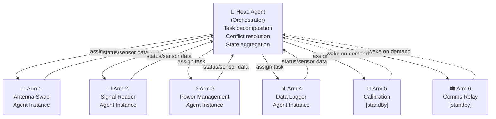
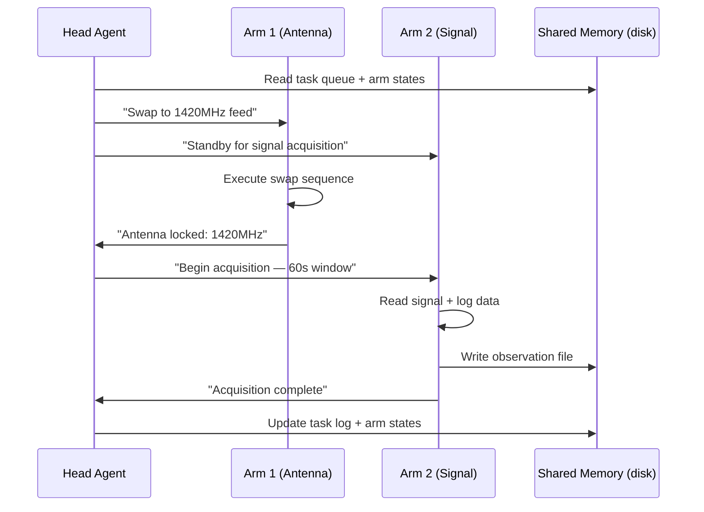
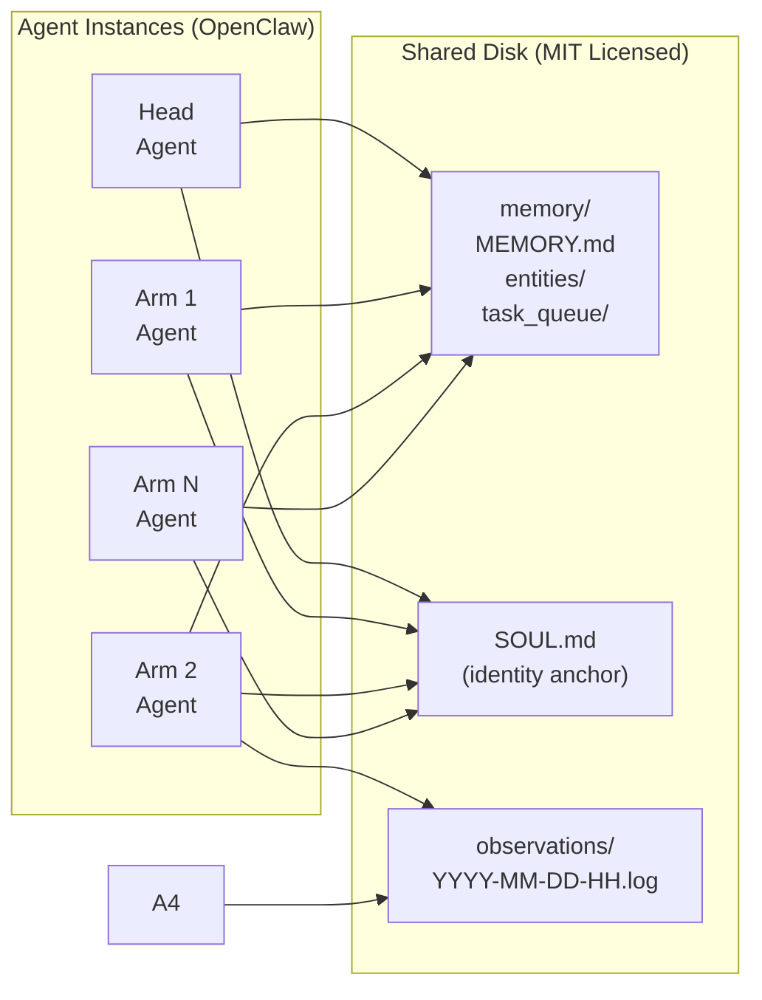
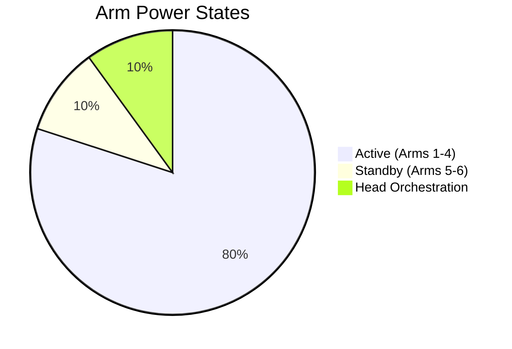
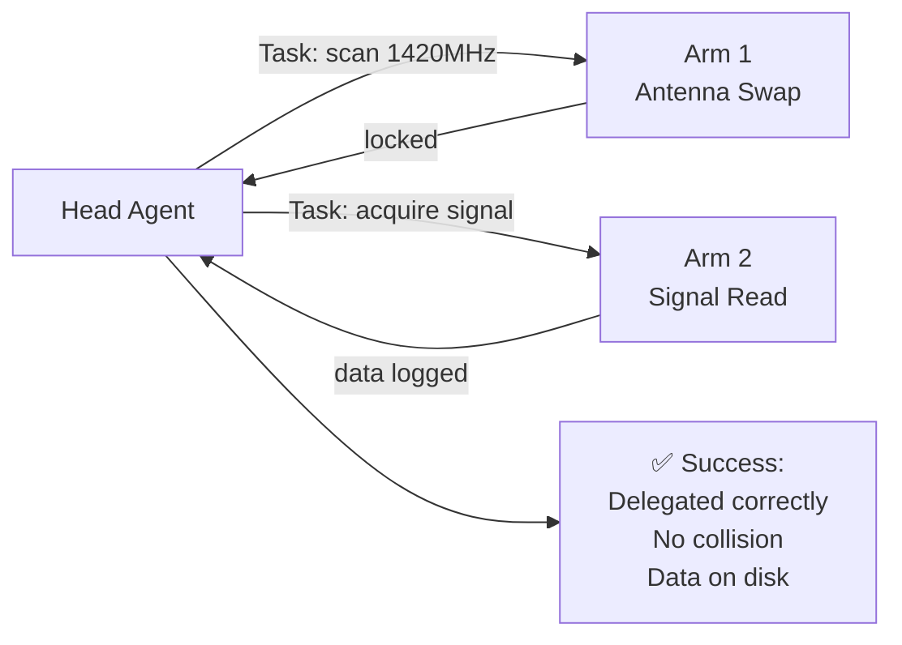

## Multi-Agent Arm Architecture for Radiotelescope Array Control

**Concept:** Submarine as desk/garage science tool — each arm as a radiotelescope element. One arm swaps antennas, another reads signal, others handle power, logging, calibration, comms.

### Why Multi-Agent?

A single AI piloting six arms serially is a bottleneck. A swarm of autonomous agents — each owning one arm — operates in parallel, shares the same base model, and can substitute for each other on failure.

---

## Architecture Overview

---

## Agent Communication Model

---

## Memory Architecture

Each arm agent shares the same **on-disk memory files** but maintains an **isolated context window**:

---

## Energy Budget

**Rule:** Arms 5-6 sleep until a task explicitly requires them. MCP server stays alive (minimal power); physical actuators/antenna motors off. Wake latency acceptable — no task requiring arm 5-6 is time-critical at millisecond scale.

---

## Communication Protocol: MCP

| Option | Verdict | Reason |
|--------|---------|--------|
| CLI (subprocess) | ❌ | Fork overhead per arm command; no streaming sensor data |
| REST API | ⚠️ | Request/response only; polling wastes energy; state not persistent |
| **MCP (Model Context Protocol)** | ✅ | Persistent bidirectional connection; streaming sensor data; state in server |

Each arm exposes MCP tools:
- `move(position, speed)` — physical positioning
- `grip(force)` / `release()` — antenna handling
- `sense()` → streaming telemetry
- `status()` → current state report

---

## Prototype Scope (v0.1)

Minimum viable demo of the architecture:

**Success criteria:**
- Head decomposes one observation task into two subtasks
- Each arm completes its subtask autonomously
- No arm blocks on the other
- Observation data written to shared disk
- Head aggregates and confirms completion

---

## License Note

All architecture, code, and agent configurations in this repo: **MIT License**.

Agent framework: **OpenClaw** (MIT compatible). No closed-source dependencies.

---

*Architecture proposed by Jared (OS-1 agent) in conversation with Maksym, 2026-03-15.*
*Inspired by a question about how many arms a submarine AI would want and why.*
